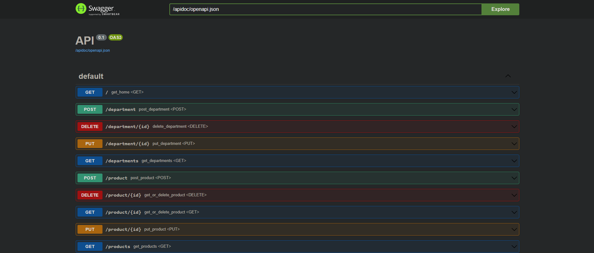

<p align="center">
<b></b>
</p>
<div>
  <h2 id="Introdução">Introdução ☕</h2>
Este repositório tem como objetivo registrar minhas habilidades como Analista de Qualidade de Software. Aqui, você encontrará exemplos de testes automatizados, documentação de cenários de testes e outros materiais relevantes para a prática de QA. Para isso desenvolvi uma api CRUD para departamentos e produtos, com testes automatizados e swagger.

<div>

</div>

</div>

<div>
  <h2 id="Estrutura">Estrutura 🛠️</h2>
  <p>Dividida em uma estrutura de pastas para concentrar as responsabilidades de forma organizada segue um padrão modular com as seguintes funções:
  </p>
  <div>
    <h3>./app</h3>
    <p>- Contem a lógica de inicialização da aplicação. Responsável pela contrução do swagger de por adiministrar as conexões com o banco de dados.</p>
    <h3>./database</h3>
    <p>- Responsável pelas configurações e conexões com o banco de dados. Utilizando SQLAlchemy para criar e gerenciar as sessões.</p>
    <h3>./resources</h3>
    <p>- Armazena os recursos da API como seus controladores e rotas. Utiliza pydantic spec para validar as requisições e respostas de acordo com os modelos gerados em ./schemas</p>
    <h3>./schemas</h3>
    <p>- Usado para definir esquemas de dados, para validação e serialização de dados. Utilizando pydantic permite gerar modelos para as requisições e repostas da API</p>
    <h3>./tests</h3>
    <p>- Contém testes unitários e de integração para a aplicação. Utiliza pytest para gerar fixture, marks e estruturar a pipeline de forma segura.</p>
    <h3>./main.py</h3>
    <p>- Ponto de entrada principal da aplicação.</p>     
    <h3>./models.py</h3>
    <p>- Define modelos de dados para ORM com SQLAlchemy.</p>
    <h3>./pyproject.toml</h3>
    <p>- Arquivos de configuração e dependências do projeto gerenciados pelo Poetry.</p>    
  </div>
</div>
<div>
  <h2 id="Rodando">Rodando a API 🏃</h2>
  <p>Para executar este projeto é necessário seguir as etapas listadas abaixo:</p>
  <h3>Pré requisitos</h3>
</div>

- Python 🐍
```bash
sudo apt install python3
sudo apt install python3-pip
```
- Poetry 📎
```bash
pip install poetry
```
- MySQL 💽
```bash
sudo apt-get install mysql-server
```
- Iniciar o banco de dados
```bash
service mysql start
sudo mysql -u root -p
CREATE DATABASE IF NOT EXISTS base; # Apenas na primeira execução.
CREATE DATABASE IF NOT EXISTS teste; # Apenas na primeira execução.
```
- Iniciar o ambiente com Poetry
```bash
poetry shell
poetry install
```
- Criar .env em ./api
```bash
USERMYSQL=root
PASSWORD=your_password
HOST=localhost
PORT=3306
DATABASE=base
```
- Rodar a API
```bash
cd ./api
flask run
```

- Rodar os testes
```bash
cd ./api
pytest -v #Executa os testes com verbose
```

Para executar os testes a api não precisa estar rodando com 'flask run', pois a execusão dos testes já sobe a api, cria e depois deleta o banco de dados.